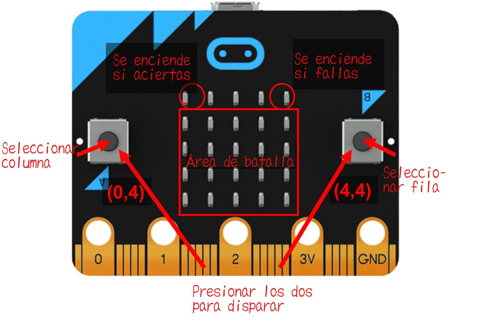
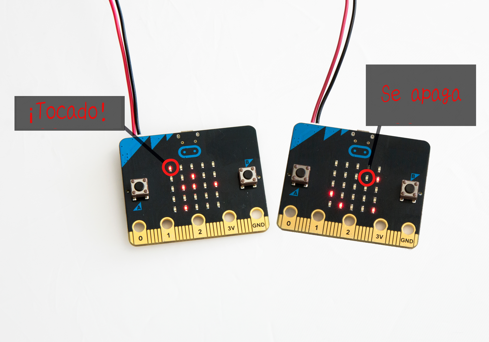
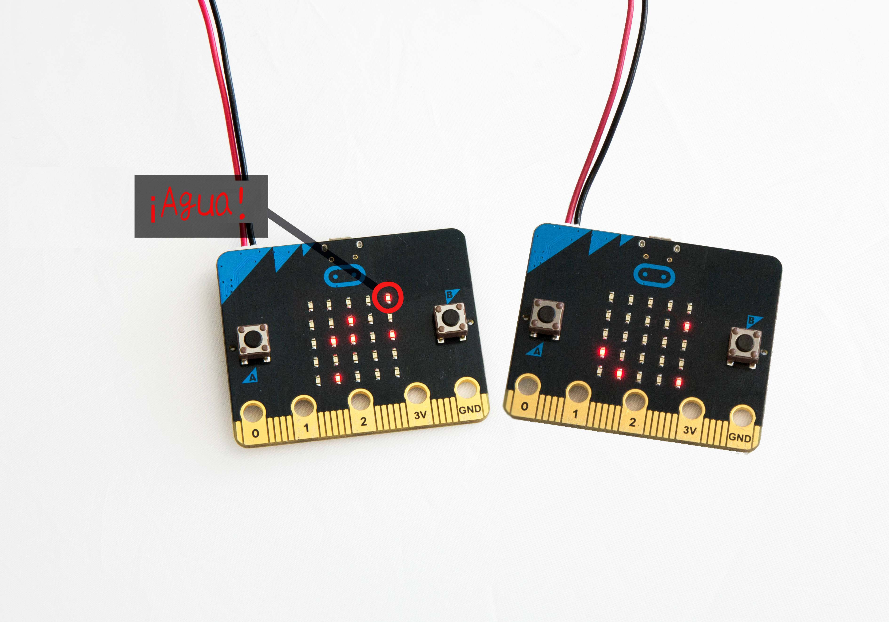

Juego 3: Hudir la flota por radio
=================================

Introducción
------------

En esta actividad vamos a programar una versión para micro:bt del famoso juego Hundir la flota, al que ya se jugaba desde la Primera Guerra Mundial, aunque con papel y lápiz [^1]. En 1967 se publicó una versión con tablero de plástico, y hoy en día existen multitud de versiones electrónicas y apps [^2].

!!! note ""
	**Figura 1:** Tablero del Hundir la flota

Para repasar cómo funciona el juego vamos a usar el tablero de ejemplo de la figura de arriba. En el ejemplo, cada jugador usa un tablero de 10x10 casillas, y la flota de cada jugador incluye 10 barcos de diferentes tamaños (los rectángulos grises). La figura muestra cómo están colocados los de un jugador: con 4 barcos de tamaño 2, 3 barcos de tamaño 3, 2 barcos de tamaño 4, y 1 barco de tamaño 6. Por supuesto, el sitio donde se han colocado los barcos es secreto y no lo conoce el oponente. Cuando ambos jugadores han colocado sus barcos comienzan a tratar de adivinar dónde están los barcos del oponente, para lo que disparan misiles que caen en la casilla escogida. En el ejemplo, las cruces muestran los disparos que ha realizado el oponente. Fíjate en que algunas de estas cruces han caído en el agua, mientras que otras han alcanzado a barcos. El oponente ha hundido el barco de las casillas 8A-8B. El barco de las casillas 6J-7J-8J ha sido alcanzado dos veces; otro disparo lo hundiría. Los jugadores van escribiendo en otro tablero los disparos que ya han realizado, donde apuntan cada acierto y cada fallo para decidir a qué casilla disparar a continuación.

Para programar Hundir la flota con las micro:bits vas a tener que poner en práctica todos tus conocimientos de redes. El juego requiere comunicación unicast bidirecciónal, algo que hemos trabajado en los temas [Comunicación unicast: De una a una](../unicast/unicast.md) y [Unicast de ida y vuelta:ping-pong](../twowayunicast/twowayunicast.md). Además, si te animas con las extensiones propuestas en los ejercicios, tendrás que hacer uso de lo aprendido en los capítulos [Gestionar errores: Retransmisiones](../retransmissions/retransmissions.md) y [Gestionar errores: Acuse de recibo](../acknowledgements/acknowledgements.md). 

En resumen, vas a practicar con:

- El concpeto de *comunicación unicast*, *unicast de ida y vuelta* y *retransmisiones*

- Envío y recepción de mensajes

- Botones de entrada

- La pantalla y sus coordenadas

- Variables y números aleatorios

- Arrays

- Bucles

### Vas a necesitar

    2 micro:bits
    1 colega

Diseñar un Hundir la flota para micro:bit
-----------------------------------------

### Cómo funciona el juego

Vamos a repasar las diferentes partes que necesitamos para programar el Hundir la flota.

**Usar la pantalla de micro:bit como tablero:** Como las micro:bits tienen una pantalla de 5x5, el tablero tendrá que ser más pequeño que el del ejemplo de la introducción. Y esto no nos va a dejar espacio para muchos barcos. Así que la flota va a tener 5 barcos, todos de tamaño 1.

Cuando dispares un misil, hay que saber si ha alcanzado a un barco o ha caído al agua. Así que hay que resevar la fila de arriba para mostrar si se trata de un acierto o de un fallo. Si la micro:bit del oponente nos dice que es un acierto, tu placa encenderá el LED de la izquierda de la fila superor. Por el contrario si es "agua", se encenderá el LED de la derecha.

Otra limitación de nuestro juego será que no podremos mostrar en pantalla un registro de las posiciones de nuestros aciertos y fallos. Quizás lo más fácil sea ir apuntándolo en papel y lápiz como se hacía en el siglo XX ;-) 

**Disparar misiles:** Para disparar misiles vamos a usar los botones, seleccionando un número de fila y de columna. Ten en cuenta que cuando las coordenadas LED se muestran como *(x,y)*, x es el número de columna, mientras que y es el número de fila. Para más información puedes echar un ojo a [https://microbit.org/guide/hardware/leds/](https://microbit.org/guide/hardware/leds/).

!!! note ""
	**Figura 2:** Hundir la flota en micro:bit

El botón A se usará para seleccionar el número de columna y el botón B para seleccionar el número de fila. Por tanto, para disparar a la posición (2,3) tendrás que presionar el botón A dos veces y el botón B 3 veces, y luego presionar los botones A y B a la vez. Para ver si lo has entendido, debatid en parejas qué secuencia de botones habría que presionar para disparar a la posición (0,4).

Cuando presiones los botones tu micro:bit enviará un mensaje a la placa del oponente. Así, por ejemplo, si quieres disparar a la posición (4,4), tu programa enviará las coordenadas (4,4). Cuando la micro:bit del oponente recibe un disparo, comprueba si ha "tocado" un barco o si ha caído al "agua", y enviará consecuentemente un mensaje por radio indicando "tocado" o "agua".

En tu micro:bit, cuando recibas "tocado" encenderás el LED de la esquina superior izquierda de la pantalla. Cuando recibas "agua", encenderás el de la esquina superior derecha.

### Una partida de ejemplo

Veamos cómo se verá una partida en las micro:bits. Al principio tus barcos se colocarán aleatoriamente en las cuatro filas inferiores de la pantalla, como en la figura de abajo. La figura muestra los 5 barcos de cada jugador colocados en la zona de batalla.

!!! note ""
	**Figura 3:** Una partida de Hundir la flota: Escenario inicial con los barcos colocados aleatoriamente

El atacante (a la izquierda) presiona el botón A 3 veces, y el botón B 1 vez. Al presionar luego los dos botones a la vez dispara y envía un mensaje a través de la radio con la coordenada (3,1). Como hay un barco en esa posición, se trata de un disparo "tocado". En la figura de abajo el LED de la posición más a la izquierda de la fila superior del atacante se enciende. Y, en la placa del oponente, el LED de la posición (3,1) se apaga, puesto que el barco ha sido hundido.

!!! note ""
	**Figura 4:** Hundir la flota: ¡Tocado! ¡Has alcanzado un barco!

Echemos un vistazo también a una situación en la que se falla con el disparo (figura de abajo). En este caso, como el disparo es "agua", en la placa del oponente no hay que cambiar nada. Pero en la del atacante, en la fila de arriba, hay que encender el LED de la derecha del todo para mostrar que se ha fallado. 

!!! note ""
	**Figura 5:** Hundir la flota: ¡Agua! No ha habido suerte, amigo

A programar: Hundir la flota
----------------------------

El Hundir la flota es un juego de dos jugadores. Por tanto, podéis programar en parejas y ejecutar los mismos programas en ambas placas, o bien podéis programar cada jugador vuestra versión, pero en este caso tendríais que poneros de acuerdo en los detalles de los mensajes de radio. 

Al trabajar en un proyecto de envergadura como este, verás que es más asequible si se divide en partes, y se va probando cada parte según se va programando. (Esta capacidad es una habilidad muy importante que se va desarrollando según vas aprendiendo más sobre la programación informática).

Es por ello que hemos dividio el programa en cuatro tareas: cuando hayas finalizado la última tarea ya tendrás todo listo para comenzar a jugar con tu pareja. Si al hacer las pruebas encontráis *bugs* (errores) en vuestros programas, trabajad en pareja para tratar de localizarlos y corregirlos, lo que se llama *depurar* errores.

### Tarea 1: Preparar la partida

**Descripción:** Esta parte tiene que ejecutarse antes de que comience la partida. Necesitarás 5 barcos en el tablero. Piensa en cómo colocar 5 barcos en el área de batalla, que es una matriz de 4x5. Contesta las siguientes preguntas:

- ¿Qué estructura de datos vas a utilizar para representar el área de batalla en tu programa?

- ¿Cómo vas a seleccionar coordenadas aleatorias (*número\_columna*,*número\_fila*) para los 5 barcos, donde *número\_columna* está entre 0 y 5, y *número\_fila* entre 1 y 5?

- ¿Cómo vas a representar la información para saber si un barco está en cada una de estas coordenadas?

También tendrás que establecer la configuración de la radio y de los paquetes para enviar mensajes unicast.

**Instrucciones:** Crea las estructuras de datos y variables necesarias para representar los barcos en el área de batalla. Establece la radio y configura los paquetes para la comunicación unicast. Prueba que tu programa puede mostrar 5 barcos colocados aleatoriamente en las cuatro filas de abajo de la pantalla, como en las figuras de ejemplo.

### Tarea 2: Disparar

**Descripción:** Cuando se presiona el botón A, se indica el *número\_columna* del disparo. Así que tienes que contar cuántas veces se ha presionado el botón para establecer el *número\_columna*. Cuando se presiona el botón B, se define el *número\_fila* de ese mismo disparo. De nuevo, cuenta el número de veces que se presiona para establecer el *número\_fila*.

**Importante:** Si no presionas ni el botón A ni el B, *número\_columna* será 0 y *número\_fila* será 0. Un disparo con *número\_fila*=0 es un desperdicio, porque no puede haber barcos en esa fila. También hay que tener en cuenta que si un botón se presiona más de cuatro veces habría que volver a contar desde 0. En otras palabras, el contador del botón debería incrementarse con cada pulsación del botón así: 0, 1, 2, 3, 4, 0, 1, 2, 3, 4.

Presionar los dos botones al mismo tiempo enviará por radio al oponente *número\_columna* y *número\_fila*. Tenéis que decidir cómo enviar este mensaje en un paquete. Si estáis escribiendo cada pareja vuestros programas por separado es fundamental que os pongáis de acuerdo en esto.

**Instrucciones:** Programa las pulsaciones de los botones A, B y A+B. El programa enviará por radio un mensaje al presionar A+B.

Prueba que el código es correcto. Añade un pequeño código de prueba para que cuando dispares, además de enviar el mensaje de radio, también se encienda el LED de la posición *número\_columna* y *número\_fila*. Esto te ayudará a comprobar que está funcionando bien. Cuando todo vaya bien, puedes borrar este código extra de prueba.

### Tarea 3: Recibir un disparo

**Descripción:** Cuando recibes un disparo tienes que comprobar si tienes un barco en esa posición (*número\_columna*,*número\_fila*). Si tienes un barco, entonces te ha tocado y hundido. Tienes que enviar un mensaje "tocado" a tu oponente y borrar el barco de la pantalla. Si no acertó a tus barcos, envías un mensaje "agua" a tu oponente.

**Instrucciones:** Dependiendo de cómo hayáis decidido formatear el mensaje, tienes que decodificar *número\_columna* y *número\_fila* del mensaje recibido. Si tienes un barco en esas coordenadas, es un acierto: apaga el LED de esa posición. Si tienes una estrucutura de datos para representar tus barcos, como una variable, tendrás que actualizarla también. Envía a tu oponente un mensaje "tocado". Si es un fallo, envía un mensaje "agua".

### Tarea 4: Recibir el resultado de un disparo: "tocado" o "agua"

**Descripción:** Enciende el LED correspondiente dependiendo del resultado. Si es "tocado", comprueba si llevas 5 aciertos. Si es así, ¡has ganado! Muestra una sonrisa en la pantalla.

**Instrucciones:** Si recibes un mensaje "tocado", enciende el LED de la izquierda de la fila superior, en la posición (0,0). Actualiza el contador de aciertos, y si has llegado a 5 muestra una sonrisa en la pantalla. Si el mensaje es "agua", enciende el LED de la esquina superior derecha, posición (4,0).

Prueba tus programas con tu oponente. Para las pruebas, quizás sea más fácil si ambos podéis ver las pantallas de los dos. Además puedes escribir algo de código extra, como hiciste en la tarea anterior. Por ejemplo, podrías imprimir "tocado" o "agua" cuando recibes y decodificas un disparo. Incluso podría ser interesante para las pruebas imprimir las coordenadas del disparo cuando recibas el paquete. Una vez tengáis todo funcionando correctamente, podéis borrar todo este código extra.

Actividad ampliada
------------------

El Hundir la flota tiene muchas variaciones. Echa un ojo a la página de la Wikipedia en la sección Recursos para leer más acerca de estas variaciones.

!!! attention "Ejercicio 1"
	Imagina una variación en la que fueran necesarios 3 disparos para hundir un barco en lugar de 1. ¿Cómo programarías esta modificación? ¿Habría que hacer cambios en el lado del emisor o del receptor? ¿Te recuerda en algo a usar retransmisiones, tal como hicimos en [Gestionar errores: Retransmisiones](../retransmissions/retransmissions.md)?
	

Problemas
--------

!!! note ""
	**Figura 6:** Hundir la flota: Un área de batalla aleatoria

**Problema 1:** La figura de arriba muestra barcos colocados aleatoriamente en un área de batalla. ¿Qué coordenadas tendrías que enviar para acertar a cada uno de los barcos?

!!! note ""
	**Figura 7:** Hundir la flota: Dos jugadores

**Problema 2:** La figura 7 muestra barcos colocados aleatoriamente en el área de batalla de dos micro:bits. La tabla de abajo muestra los disparos que se han realizado desde micro:bit 1 (micro:bit izquierda/roja) and micro:bit 2
(micro:bit derecha/amarilla). ¿Quién ha ganado?

| **Rondas** | **Micro:bit 1** | **Micro:bit2** | **Resultado** |
|------------|:----------------|:---------------|:-----------|
| 1 | (3,1) | (2,1) | |
| 2 | (0,3) | (0,1) | |
| 3 | (1,1) | (3,2) | |
| 4 | (4,1) | (3,3) | |
| 5 | (0,3) | (4,3) | |
| 6 | (2,2) | (0,3) | |
| 7 | (3,2) | (1,4) | |

[^1]: Hundir la flota en Wikipedia: [https://es.wikipedia.org/wiki/Batalla_naval_(juego)](https://es.wikipedia.org/wiki/Batalla_naval_(juego))

[^2]: Hundir la flota online: [http://es.battleship-game.org/](http://es.battleship-game.org/) 
