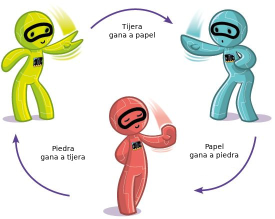
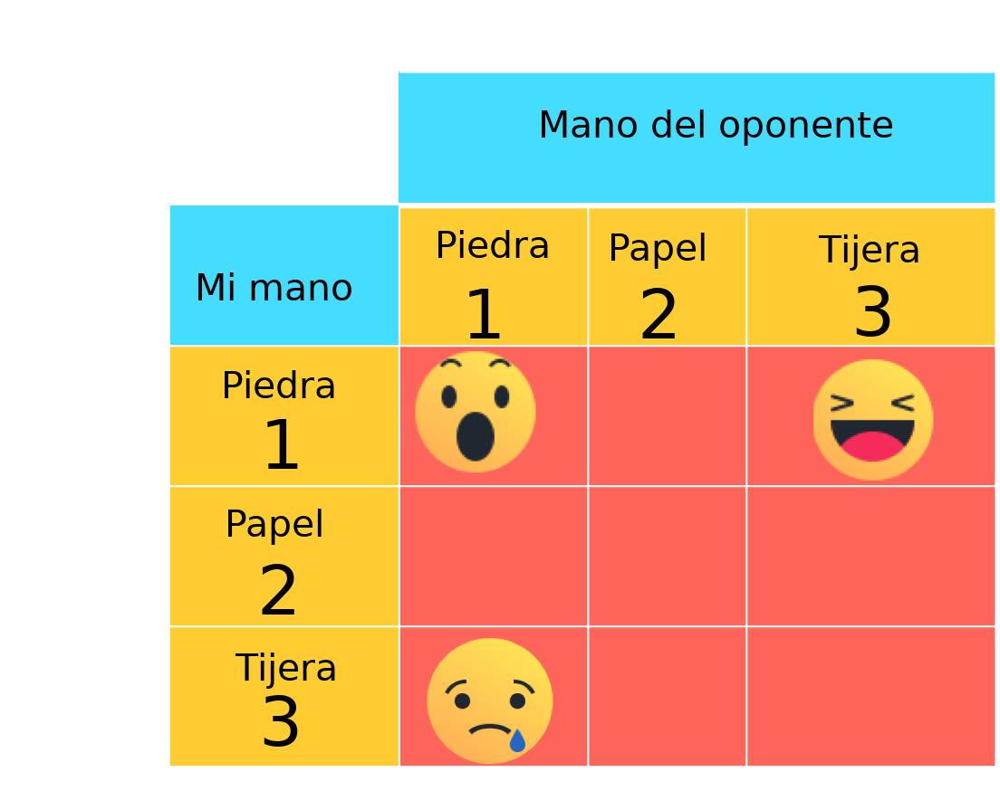

Juego 2: Piedra, papel o tijera por radio
=========================================


Introducción
------------

¡Juguemos a Piedra, papel o tijera! Como sabes, es un juego de dos jugadores. Cada jugador, al mismo tiempo, forma con sus manos una de las opciones (piedra, papel o tijera). Se usan las siguientes reglas para decidir quién gana:

- La piedra aplasta a la tijera.

- La tijera corta el papel.

- El papel cubre la piedra.

- Si ambos jugadores escogen la misma forma, empatan.

La siguiente figura resume las reglas.



!!! note ""
	**Figura 1:** Reglas de Piedra, papel o tijera.

En este capítulo vamos a progrmar este juego con nuestras placas micro:bit. Y al hacerlo practicaremos:

- *Comunicación unicast*

- Uso de variables

- Uso de condicionales

### Necesitarás

    2 micro:bits
    1 pizarra
    rotuladores/notas adhesivas
    1 colega

A programar: Piedra, papel o tijera
-----------------------------------

Para programar el juego es mejor trabajar en parejas. En la tarea 1 os vais a familiarizar con el juego y no usaréis la radio. A partir de la tarea 2 será cuando nos lancemos a usar la radio.


### Tarea 1: Empezamos con el juego base

**Descripción:** Para familiarizarnos con el juego, sigue la actividad [Piedra-papel-tijera](https://makecode.microbit.org/projects/rock-paper-scissors), que te guiará paso a paso en la construcción de una versión sencilla del juego. Fíjate en que el programa asigna un número a *piedra*, *papel* y *tijera*. Por ejemplo, piedra=1, papel=2, tijera=3.

**Instrucciones:** Programa el código mostrado en la página de la actividad y descárgalo a tu micro:bit. Juega unas partidas con tu pareja. Tendréis que agitar las placas al mismo tiempo y luego decidir quién gana en base a las reglas descritas en la introducción.


### Tarea 2: Enviamos la forma seleccionada por radio con unicast

**Descripción:** Para jugar por radio usarás el botón A para seleccionar entre piedra, papel o tijera. Usarás el botón B para confirmar la selección y enviarla por radio. Al igual que en la tarea 1, se usará: piedra=1, papel=2, tijera=3.


**Instrucciones:** Escribe un programa que haga lo siguiente:

1. Usa el botón A para seleccionar entre piedra, papel o tijera. Cada vez que pulses el botón A debería mostrar alternativamente un icono de cada una de las tres formas.

2. Usa el botón B para confirmar tu selección y enviar el número correspondiente por radio mediante comunicación unicast a la placa de tu pareja, tal como hicimos en las prácticas del capítulo [Comunicación Unicast: De una a una](../unicast/unicast.md).

3. Añade el código para recibir un número. Cuando recibas un número, muestra el icono correspondiente en la pantalla. Por ejemplo, si recibes un 2 deberías mostrar el icono del papel.

Comprobad en pareja que podéis enviar y recibir correctamente.


### Tarea 3: Rellenamos la tabla de reglas

**Descripción:** Tu programa debe decidir quién gana cuando recibes un número desde la micro:bit de tu colega.

**Instrucciones:** Para decidir quién gana, hay que comparar el número que tú escogiste con el número que has recibido por radio. La tabla de abajo puede ayudarte a decidir quién gana cada partida [^2]. Usando esta tabla puedes comparar *Mi mano* con *Mano oponente*. Por ejemplo, si los dos números significan *papel*, es un empate y el resultado es una cara de sorpresa. Pero si *Mi mano* es *papel* y *Mano oponente* es *tijera*, el resultado es una cara triste. Y si fuera al contrario el resultado sería una cara alegre. En base a las reglas del juego, termina de rellenar la tabla.




!!! note ""
	**Figura 2:** Tabla Pedra, papel o tijera
	
### Tarea 4: El juego completo

**Descripción:** Una vez rellena la tabla hay que decir cómo programar estas reglas en tu código. El programa deberá:

1. permitir jugar partidas en base  las reglas del juego

2. mostrando una cara *alegre* si ganas tú, una cara *triste* si pierdes, y una cara *sorprendida* si es un empate.

**Instrucciones:** A continuación se muestra una plantilla que puede ayudarte a programar la tabla de reglas utilizando bloques *si* del menú *Lógica* en el editor de bloques de JavaScript. El objetivo de la plantilla es darte tan solo una idea de la estructura del programa. 

Como verás, en la plantilla se usan dos variables: *seleccionado* y *recibido*. *seleccionado* se establece a *Verdadero* cuando haces la selección de mano al presionar el botón B. Por su parte, *recibido* se pone a *Verdadero* cuando recibes la mano de tu oponente. En el bloque *Por siempre*, verás que solo se comprueba la jugada cuando ambas variables son *Verdadero*. Una vez entras en el bloque para jugar la partida, las variables se ponen a *Falso* para la siguiente ronda.

Una vez programadas las placas, jugad en pareja unas cuantas partidas a ver quién gana más.


```blocks
alPresionarBotón(B){
    seleccionado = true
    radio.enviarNúmero(mi_mano)
}
```
```blocks
radio.alRecibirNúmero(númeroRecibido) {
    recibido = true
    mano_oponente = númeroRecibido
}
```
```blocks
mi_mano = 0
mano_oponente = 0
recibido = false
seleccionado = false
porSiempre {
    si (seleccionado == true && recibido == true) {
        seleccionado = false
        recibido = false
        si (mano_oponente == mi_mano) {
            básico.mostrarIcono(Sorprendido)
        } sino {
            si (mi_mano == 2 && mano_oponente == 1) {
                básico.mostrarIcono(Alegre)
            } sino si (...) {
            	
            } sino si (...) {
            	
            } sino {
            	
            }
        }
    }
})
```

!!! note ""
	**Figura 3:** Una plantilla para programar las reglas de Piedra, papel o tijera
	
Ejercicios
----------

!!! attention "Ejercicio 1"
	¿Cómo podrías ampliar el programa para jugar a piedra/papel/tijera/lagarto/spock? Para saber más sobre esta extensión puedes echar un ojo a estos enlaces:
	- Vídeo de The Big Bang Theory <https://www.youtube.com/watch?v=_tsy4q9ibAE>
	- Desafío TNT <https://cadenaser.com/ser/2012/03/03/cultura/1330733828_850215.html>
	

Problemas
---------

1. ¿Cómo se comprueba que hay un empate en el programa?

2. ¿Cómo cambia la tabla si papel=2, piedra=0, y tijera=1? Dibuja la nueva tabla.

3. Para echar una partida contra un jugador distinto, ¿qué habría que cambiar en tu programa? Recuerda que estás usando unicast para la comunicación por radio.

4. ¿Qué ocurre si envías tu mano al otro jugador antes de que escoja la suya? ¿Habría algún problema? ¡¿Podría hacer trampas?!


Recursos
--------

- Wikipedia: piedra, papel o tijera - 
    <https://es.wikipedia.org/wiki/Piedra,_papel_o_tijera>
    
- Vídeo: cómo ganar siempre jugando a Piedra, papel o tijera - 
    <https://www.youtube.com/watch?v=i0_Y0ll6Z08>

